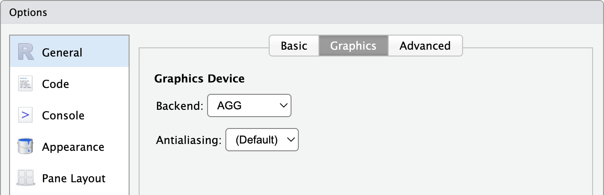

```{r setup, include=FALSE}
library(tidyverse)
library(officer)
library(flextable)
library(munch)
library(gdtools)
library(patchwork)

knitr::opts_chunk$set(
  echo = FALSE,
  message = FALSE,
  warning = FALSE,
  dev = "ragg_png",
  dpi = 200,
  fig.align = "center",
  out.width = "100%"
)

font_set_liberation()
set_flextable_defaults(font.family = "Liberation Sans")
set_theme(
  theme_minimal(base_family = "Liberation Sans", base_size = 11) +
    theme(
      plot.background = element_rect(fill = "#EFEFEF", colour = "transparent"),
      panel.background = element_rect(fill = "#EFEFEF", colour = "transparent"),
      panel.grid.minor = element_blank()
    )
)

r_logo <- file.path(R.home("doc"), "html", "logo.jpg")
dat <- subset(diamonds, cut %in% c("Premium", "Ideal"))

set.seed(8)
dummy_dat <- iris[sample.int(n = 150, size = 3), ]
dummy_dat <- dummy_dat[order(dummy_dat$Species), ]
```

## Ressources


| Présentation | Sources |
|---|---|
| {width="3in"} | {width="3in"} | 
| https://www.ardata.fr/talks/munch-intro | https://github.com/ardata-fr/munch-introduction |


## Introduction


:::: {.columns}

::: {.column width="50%"}

> 'munch' crunches markdown text and 'flextable' paragraphs into grid graphics.


:::

::: {.column width="50%"}

```{r}
ft <- flextable(dummy_dat) |> 
  mk_par(
    j = ~ . - Species,
    value = as_paragraph(
      as_chunk(.),
      " ",
      minibar(.,
        barcol = "white",
        height = .1
      )
    ), use_dot = TRUE
  ) |> theme_vader() |> autofit()
ft
```

:::

::::

'munch' a pour objectifs de :

- transformer des expressions markdown simples en 
paragraphes flextable 
- transformer des paragraphes flextables en objets 
graphiques 'grid' (grobs). 

On peut ainsi annoter des graphiques R basés sur 'grid' ('ggplot2') avec des 
paragraphes contenant du texte riche. En bonus, 'flextable' bénéficie
d'un support markdown simple sans pandoc/quarto.


## Avant

```{r}
# Avant : ggplot2 par défaut
p_before <-
  ggplot(
    data = penguins,
    mapping = aes(
      x = bill_len,
      y = flipper_len
    )
  ) +
  geom_point(
    mapping = aes(colour = species), 
    size = 3, alpha = .8, show.legend = FALSE
  ) +
  scale_color_manual(
    values = c(
      Adelie = "darkorange",
      Chinstrap = "purple",
      Gentoo = "cyan4"
    )
  ) +
  labs(
    title = "Flipper and bill length (millimeters)",
    x = "Flipper length (mm)",
    y = "Bill length (mm)",
    caption = "Graph made with munch from ArData"
  )

p_before
```

## Après


```{r}
# Après : enrichi avec munch
subtitle_chunks <- as_paragraph(
  as_i("(ceci n'est pas une légende mais un sous-titre)"),
  " Adelie ",
  colorize("\u23FA", color = "darkorange") ,
  " Chinstrap ",
  colorize("\u23FA", color = "purple") ,
  " Gentoo ",
  colorize("\u23FA", color = "cyan4")
)
my_tag <- "Graph made with munch from "

p_after <- p_before +
  labs(
    title = "Flipper and bill **length** *(millimeters)*",
    subtitle = "X",
    x = "Flipper length *(mm)*",
    y = "Bill length *(mm)*",
    caption = my_tag
  ) + 
  theme(
    plot.title = element_md(),
    axis.title.x = element_md(),
    axis.title.y = element_md(),
    plot.caption = element_md(),
    plot.subtitle = element_chunks(subtitle_chunks, lineheight = 1.3)
  )

p_after
```


## Une base de code existante

'flextable' contient déjà le code pour produire du texte riche dans 'grid' (<https://www.ardata.fr/post/2023/04/03/flextable-grid/>).


```{r echo=FALSE}
library(gdtools)
library(flextable)
library(gfonts)

dummy_ft <- data.frame(zzzz = ";)") |>
  flextable() |>
  color(color = "white", part = "all") |>
  mk_par(
    value = as_paragraph(
      as_chunk("made", props = fp_text_default(font.size = 30, color = "#f2af00")),
      as_chunk(" with\n", props = fp_text_default(color = "gray", font.size = 15)),
      as_chunk("flextable", props = fp_text_default(color = "#c32900", font.size = 45))
    ),
    part = "header") |>
  autofit() |>
  align(align = "center", part = "all") |>
  border_outer(border = fp_border_default(width = 0))

gen_grob(dummy_ft, fit = "width", scaling = "full") |> plot()
```

**'munch' reprend la mécanique de 'flextable' et la dédie aux annotations 'ggplot2' en ajoutant le support du markdown grâce à 'commonmark'.**

## Fonctionnalités principales

**Deux types d'entrées sont supportés** : Markdown (simple) ou chunks flextable (avancé).

| Fonction | Rôle | Entrée |
|---|---|---|
| `element_md()` | Markdown dans les éléments de thème | Chaîne de caractères |
| `element_chunks()` | Mise en forme avancée dans le thème | Objet `as_paragraph()` |
| `geom_text_md()` | geom texte Markdown | Esthétique `label` |
| `geom_label_md()` | geom label Markdown | Esthétique `label` |

Fonctionnalité non creusée dans cette présentation : support du markdown pour 
'flextable' avec `munch::as_paragraph_md()`.

## Markdown dans le thème

Il faut utiliser `element_md()`.

```{r element-md}
#| echo: true
#| output-location: column
#| fig-width: 5
#| fig-height: 4.5
p_before + 
  labs(
    title = "~~Flipper~~ `and` bill **length** *(millimeters)*"
  ) +
  theme(
    plot.title = element_md(size = 12),
  )
```

## Mise en forme avancée dans le thème

Il faut utiliser `element_chunks()`. Les fonctions *chunk* sont nombreuses : `as_chunk`, `as_b`, `as_i`, `as_sub`, `as_sup`, `as_highlight`, `colorize`, `as_equation`, `as_image`, `gg_chunk`.


```{r element-chunks}
#| echo: true
#| output-location: column
#| fig-width: 5
#| fig-height: 4.5
a_paragraph <- as_paragraph(
  as_chunk(
    "made", 
    props = fp_text_default(font.size = 30, color = "#f2af00")
  ),
  as_chunk(
    " with ", 
    props = fp_text_default(color = "gray", font.size = 15)
  ),
  as_chunk(
    "munch", 
    props = fp_text_default(color = "#c32900", font.size = 45)
  )
)
p_before + 
  theme(
    plot.title = element_chunks(a_paragraph)
)
```


## Dans le panneau

Il faut utiliser `geom_text_md()` ou `geom_label_md()`.

```{r geom-md}
#| echo: true
#| output-location: column
#| fig-width: 5
#| fig-height: 4.5
note <- data.frame(
  mpg = 22, wt = 5.2,
  label = "Une **annotation** un peu *longue* se répartit automatiquement sur plusieurs lignes."
)
ggplot(mtcars, aes(mpg, wt)) +
  geom_point(alpha = .3) +
  geom_text_md(
    data = note, aes(label = label),
    width = "auto", hjust = 0, size = 4.5
  ) +
  geom_label_md(
    label = "Modèle **léger**",
    x = 28, y = 2, fill = "white"
  )
```

## Fonctionnement


Deux entrées, 'markdown' ou chunks flextable.

Les chaînes 'markdown' et chunks flextable sont transformés tous les deux
vers le même modèle de **chunks**, puis ces chunks sont mesurés, répartis sur une ou plusieurs lignes et enfin transformés en grobs.


```{=html}
<div class="pipeline">

  <div class="io-stack">
    <div class="io-card">
      <span class="io-kicker">Entrée</span>
      <span class="io-name">Markdown</span>
      <span class="io-sub">commonmark le traite</span>
    </div>
    <div class="io-card">
      <span class="io-kicker">Entrée</span>
      <span class="io-name">Chunks flextable</span>
      <span class="io-sub">as_paragraph()</span>
    </div>
  </div>

  <svg class="merge" viewBox="0 0 56 130" preserveAspectRatio="xMidYMid meet" aria-hidden="true">
    <defs>
      <marker id="ph" markerWidth="7" markerHeight="7" refX="5" refY="3" orient="auto">
        <path d="M0,0 L6,3 L0,6 Z" fill="#94A3B8"/>
      </marker>
    </defs>
    <path d="M2,32 C30,32 26,65 52,65" marker-end="url(#ph)"/>
    <path d="M2,98 C30,98 26,65 52,65" marker-end="url(#ph)"/>
  </svg>

  <div class="hub">
    <span class="hub-kicker">Modèle commun</span>
    <span class="hub-name">Chunks (mots)</span>
  </div>

  <span class="flow-arrow">→</span>
  <div class="flow-step pipe-step">
    <span class="step-num">Mesure</span>
    <span class="step-title">Calcul des métriques</span>
    <span class="step-desc">gdtools & systemfonts</span>
  </div>

  <span class="flow-arrow">→</span>
  <div class="flow-step pipe-step">
    <span class="step-num">Découpe</span>
    <span class="step-title">Production de lignes</span>
    <span class="step-desc">et wrapping automatique</span>
  </div>

  <span class="flow-arrow">→</span>
  <div class="flow-step pipe-step">
    <span class="step-num">Rendu</span>
    <span class="step-title">grobs grid</span>
    <span class="step-desc">texte, raster, rectangles et lignes</span>
  </div>

</div>
```


## La mesure du texte {.smaller}

:::: {.columns}

::: {.column width="30%"}

'systemfonts' localise la police, 'gdtools' calcule les métriques avec 'Cairo'. On mesure pour chaque chunk : sa largeur, son ascent et son descent.

Ces mesures vont permettre le *wrapping*, c'est-à-dire qu'on accumule
la largeur des mots (et ou images) jusqu'à `width`, puis on passe à la ligne. 

On doit ensuite ajouter les surlignages et *barrés* (rectangles et traits qui doivent être alignés
avec la ligne mais positionnés sur le texte).

:::

::: {.column width="70%"}


```{=html}
<div class="measure-demo">
  <div class="mbox">
    <span class="word measured">
      Une
      <span class="baseline"></span>
      <span class="m-w"><span>width</span></span>
      <span class="m-asc"><span>ascent</span></span>
      <span class="m-desc"><span>descent</span></span>
    </span>
    <span class="word">annotation</span>
    <span class="word">un</span>
    <span class="word">peu</span>
    <span class="word">longue</span>
    <span class="word">se</span>
    <span class="word">répartit</span>
    <span class="word">sur</span>
    <span class="word">plusieurs</span>
    <span class="word">lignes.</span>
    <span class="m-limit"><span>largeur cible</span></span>
  </div>
  <p class="mcap">
    Chaque mot est mesuré (<strong>width</strong>, <strong>ascent</strong> et
    <strong>descent</strong> depuis la ligne de base, en pointillé). On accumule
    les largeurs jusqu'à la <strong>largeur cible</strong>, puis on passe à la
    ligne.
  </p>
</div>
```

:::

::::


## La contrainte : polices & devices {.smaller}

Si le device n'utilise pas 'systemfonts' ou 'cairo', il ne travaillera pas avec 
le même système de métriques que celui de 'munch' et on pourra voir des 
chevauchements et ou débordements.

| Device | Rendu |
|---|---|
| `ragg`, `svglite`, `ggiraph` | OK |
| `cairo_pdf()`, `png(type = "cairo")` | OK si police installée au niveau système |
| `pdf()`, `png()`, `jpeg()` | KO |

<br>

:::: {.columns}

::: {.column width="50%"}
'munch' avertit lorsque le device est incompatible. Pour utiliser 'ragg' dans 
RStudio par défaut, votre RStudio doit être configuré comme à droite.

Dans shiny : `options(shiny.useragg = TRUE)`

Avec knitr : `opts_chunk$set(dev = "ragg_png")`

:::

::: {.column width="50%"}

:::

::::


## Limites

'munch' fait peu de choses, mais les fait bien pour satisfaire les besoins 
d'ArData et de ses clients. Quelques limites à connaître :

```{=html}
<div class="problem-grid">
  <div class="problem-card">
    <span class="problem-title">Markdown : un seul paragraphe</span>
    <span class="problem-desc">
      L'entrée markdown attend <strong>un seul paragraphe</strong> : pas de titres,
      de listes, ni de blocs de code. Pour du markdown multi-blocs, voir
      <code>marquee</code>.
    </span>
  </div>
  <div class="problem-card">
    <span class="problem-title">Markdown ne couvre pas tout</span>
    <span class="problem-desc">
      Exposant, indice, couleurs et surlignage ne sont pas en markdown : il faut
      passer aux chunks flextable avec <code>element_chunks()</code>
      (<code>as_sup()</code>, <code>colorize()</code>, <code>as_highlight()</code>…).
    </span>
  </div>
  <div class="problem-card">
    <span class="problem-title">Il faut maîtriser sa chaîne graphique</span>
    <span class="problem-desc">
      Comprendre ce qu'est un <emp>device</emp>, comprendre ce qu'est une <emp>police</emp>
      et savoir comment on les utilise et lesquels sont à choisir. L'utilisation de 'systemfonts' 
      est une limite forte.
    </span>
  </div>
  <div class="problem-card">
    <span class="problem-title">Pas de mise à l'échelle automatique</span>
    <span class="problem-desc">
      L'empreinte d'un paragraphe a un minimum (son contenu à sa taille de
      police) ; un mot insécable ne se réduit pas. Si la zone allouée (un
      sous-titre sur un petit graphe, par ex.) est plus petite que ce minimum,
      le texte déborde ou est tronqué. Parade : réduire <code>font.size</code>,
      raccourcir le texte, ou agrandir la figure.
    </span>
  </div>
</div>
```

## Illustration avec ggplot2+flextable+munch 

```{r echo=TRUE}
caption_paragraph <- as_paragraph(
  as_chunk("Graph", props = fp_text_default(color = "#0097C3")), as_i(" made"), " with ",
  as_highlight("ggplot2", color = "#F8D7DA"), ", ", as_highlight("patchwork", color = "#D1ECF1"),
  ", ", as_highlight("flextable", color = "#FFF3CD"), " and ", as_highlight("munch", color = "#E2D9F3")
)
```


```{r echo=FALSE}
dataset <- data.frame(
  team = c(
    "FC Bayern Munchen", "SV Werder Bremen", "Borussia Dortmund",
    "VfB Stuttgart", "Borussia M'gladbach", "Hamburger SV",
    "Eintracht Frankfurt", "FC Schalke 04", "1. FC Koln",
    "Bayer 04 Leverkusen"
  ),
  matches = c(2000, 1992, 1924, 1924, 1898, 1866, 1856, 1832, 1754, 1524),
  won     = c(1206,  818,  881,  782,  763,  746,  683,  700,  674,  669),
  lost    = c( 363,  676,  563,  673,  636,  625,  693,  669,  628,  447)
) |> 
  mutate(
    win_pct = won / matches * 100,
    loss_pct = lost / matches * 100,
    team = factor(team, levels = rev(team))
  )

df_long <- dataset |>
  pivot_longer(
    cols = c(loss_pct, win_pct),
    names_to = "type", values_to = "pct"
  ) |>
  mutate(type = if_else(type == "loss_pct", "lost", "won"))

pal <- c(lost = "#EFAC00", won = "#28A87D")


p <- ggplot(df_long, aes(x = pct / 100, y = team)) +
  stat_summary(geom = "linerange", fun.min = "min", fun.max = "max", linewidth = .7, color = "grey60") +
  geom_point(aes(fill = type), size = 4, shape = 21, stroke = .8, color = "white") +
  scale_x_continuous(
    labels = scales::percent,
    expand = expansion(add = c(.02, .02))
  ) +
  scale_y_discrete(name = NULL, guide = "none") +
  scale_fill_manual(values = pal, guide = FALSE) +
  labs(x = NULL, fill = NULL, caption = "x") +
  theme(
    plot.caption = element_chunks(caption_paragraph),
    panel.grid.minor = element_blank(),
    panel.grid.major.y = element_blank()
  )
ft_dat <- dataset[, c("matches", "loss_pct", "win_pct", "team")]
ft_dat$team <- as.character(ft_dat$team)

ft <- flextable(ft_dat) |>
  border_remove() |>
  bold(part = "header") |> 
  colformat_double(j = c("win_pct", "loss_pct"), digits = 1, suffix = "%") |>
  set_header_labels(team = "Equipe", matches = "MJ", win_pct = "Gagnés", loss_pct = "Perdus") |>
  color(color = c("#28A87D", "#EFAC00"), j = c("win_pct", "loss_pct")) |>
  italic(j = "team", italic = TRUE, part = "all") |>
  align(align = "right", part = "all") |>
  autofit()


wrap_flextable(ft, flex_body = TRUE, just = "right") +
  p +
  plot_layout(
    widths = c(1.3, 2)
  )
```


